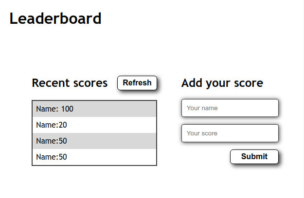

# Leaderboard


> In this project, I set up a basic JavaScript project for the Leaderboard list app, using webpack and ES6 features, notably modules. The project uses the Leaderboard API.



## Built With

- HTML/CSS
- Javascript
- Git/Github
- CLI
- Npm
- Webpack

## Live Demo

[Live Demo Link](https://ismailco.github.io/Leaderboard/dist/)

## Getting Started

To get a local copy up and running follow these simple example steps.

### Prerequisites

### Setup

To get the project up and running you need a browser, npm installed, and a terminal.

### Install

To get the project locally, run

```
$ git clone git@github.com:Ismailco/Leaderboard.git
```

Then

```
$ npm install
$ npm run build
```

### Development

to use the app localy you need to install npm then:

```
$ npm start
```

### Run tests

For Eslint test run:

```
$ npx eslint .
```

For Webhint test run:

```
$ npx hint .
```

For Stylelint test run:

```
$ npx stylelint "**/*.{css.scss}"
```

## Authors

👤 **Ismail Courr**

- GitHub: [@ismailco](https://github.com/ismailco)
- Twitter: [@ismailcourr](https://twitter.com/ismailcourr)
- LinkedIn: [Ismail Courr](https://linkedin.com/in/ismailcourr)

## 🤝 Contributing

Contributions, issues, and feature requests are welcome!

Feel free to check the [issues page](../../issues/).

## Show your support

Give a ⭐️ if you like this project!

## 📝 License

This project is [MIT](./LICENSE) licensed.
